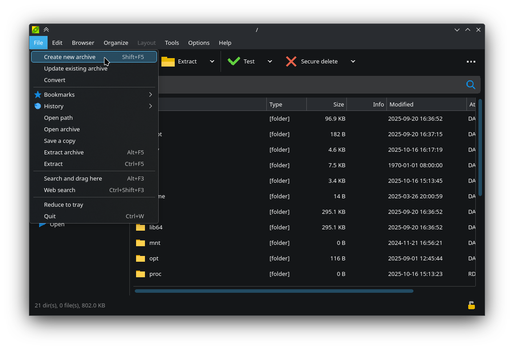
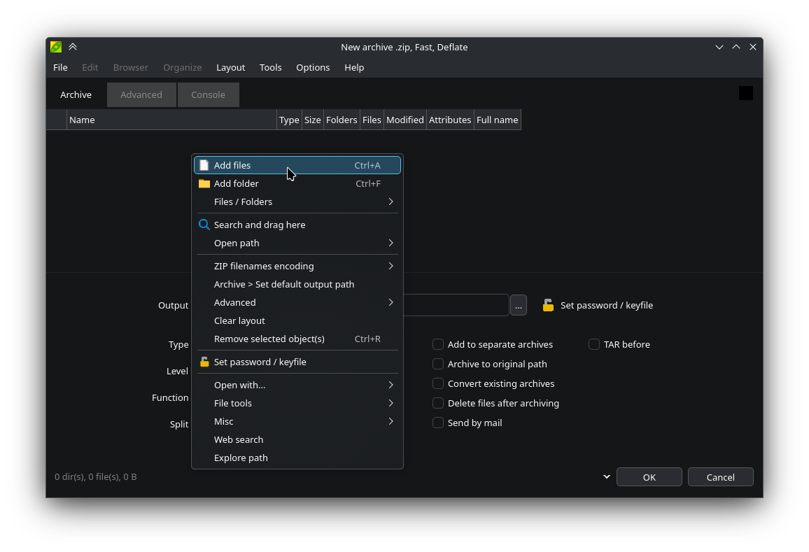
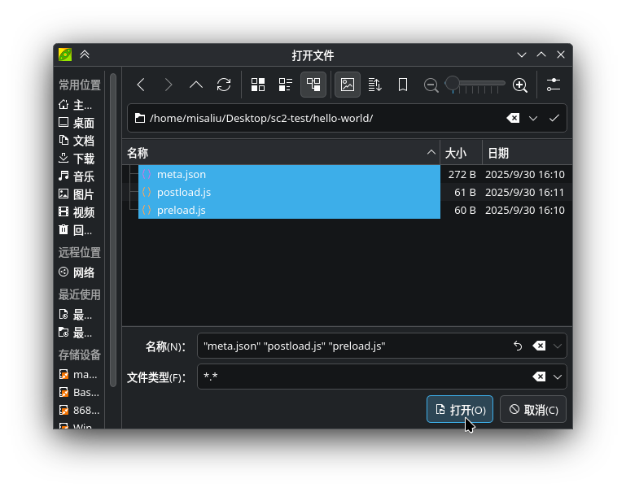
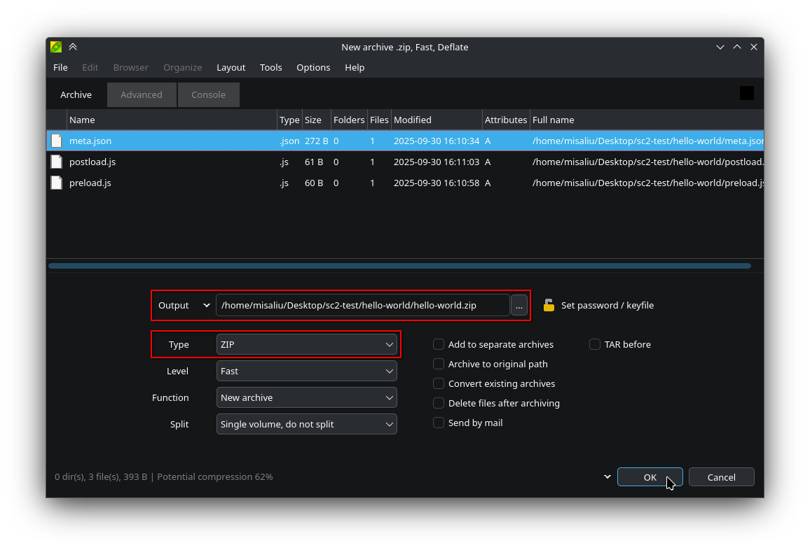

## Preliminary Learning

SugarCube is a game engine built with HTML5 technology. Before creating a mod, we strongly recommend that you [learn JavaScript](https://developer.mozilla.org/docs/Learn_web_development/Core/Scripting/What_is_JavaScript). If you need custom styles, you may also want to [learn CSS](https://developer.mozilla.org/docs/Learn_web_development/Getting_started/Your_first_website/Styling_the_content).

SugarCube comes with jQuery v3. jQuery is a JavaScript library that makes it easier to manipulate HTML. You can learn jQuery [here](https://www.w3schools.com/jquery/).

## Environment Preparation

* A suitable archive tool. If you don’t know what to choose, [7-Zip](https://www.7-zip.org/) or [PeaZip](https://peazip.github.io/) are good options.
* A suitable text editor. If you don’t know what to choose, [VSCode](https://code.visualstudio.com/) or [Sublime Text](https://www.sublimetext.com/) are good options.

## File Structure

The internal file structure of a YASCML mod package typically looks like this:

```
hello-world/
├─ meta.json
├─ preload.js
├─ main/
│   └─ foo.js
└─ styles.css
```

Make sure the `meta.json` file is located in the root directory of the mod package; otherwise, YASCML will not be able to find it.

## Writing meta.json

YASCML uses a JSON file (`meta.json`) to define the metadata of a mod. The `meta.json` file must be placed in the root directory of the mod package to indicate that the archive is a valid YASCML mod.

A minimal `meta.json` file looks like this:

```jsonc
{
  // The mod ID. This field is the unique identifier of the mod. Do not change it arbitrarily.
  "id": "hello-world",
  // The mod name. This field is usually displayed in the mod manager.
  "name": "Hello world",
  // The mod author. This field supports multiple formats. See https://yascml.github.io/reference/meta.json.html#author
  "author": "Misa Liu",
  // The mod version. This field must follow the Semantic Versioning specification, otherwise YASCML will refuse to load it.
  "version": "1.0.0"
  // ...
  // For the complete meta.json reference, see https://yascml.github.io/reference/meta.json.html
}
```

That’s right—a minimal `meta.json` does not need to include any scripts! However, such a mod will have no functionality and can only be used for other mods to read data from its package. To implement any functionality, you must write mod scripts for it.

## Writing Mod Scripts

You are free to write mod scripts in JavaScript. We recommend following these guidelines:

* Unless absolutely necessary, **DO NOT** directly modify the game data inside `<tw-storydata>`. Instead, use existing dependency mods (such as YASCHook) to modify game data.
* Use an [Immediately Invoked Function Expression (IIFE)](https://developer.mozilla.org/docs/Glossary/IIFE) to wrap your script code. This prevents variables from leaking into the global scope and causing unpredictable conflicts:
    ```js
    (function() {
      'use strict';
      // ...your codes here
      console.log('Mod loaded!');
    })();
    ```
* To reduce the size of your mod and avoid conflicts, prefer using dependency mods rather than re-implementing functionality yourself.

By default, scripts only support synchronous initialization. If your script needs to wait for asynchronous operations (such as loading remote resources), add them to `window.__AfterInit`:

```js
async function asyncInit() {
  // Async actions...
}

window.__AfterInit.push(
  asyncInit
);
```

## Packaging the Mod Files

### Modifying `meta.json`

We need to modify the `meta.json` file so that YASCML can properly load and run the scripts we just wrote. You need to add the [`preloadScripts`](../reference/meta.json.md#preloadscripts) and/or [`postloadScripts`](../reference/meta.json.md#postloadscripts) fields:

```jsonc
{
  // ...
  "preloadScripts": [
    "preload.js"
  ],
  "postloadScripts": [
    "main/foo.js"
  ],
  // ...
}
```

If you are unsure which to choose, refer to the [YASCML Life Cycle](../reference/life-cycle.md).

### Creating the Mod Package

Here we will use [PeaZip](https://peazip.github.io/) as an example to demonstrate how to create a mod package.

1. Launch PeaZip, and from the top `File` menu select `Create new archive`:
    
2. Right-click in the file list and select `Add files`:
    
3. In the file selector, choose `meta.json` and your script files:
    
4. Check PeaZip’s compression parameters:
    * Ensure `Type` is set to `ZIP`
    * Ensure `Split` is set to `Do not split`
    * Ensure the archive password is empty (the yellow lock icon next to the output directory should be unlocked)
    * Remember the output location of the archive
    
5. Click `OK` in the bottom-right corner, and the mod package will be successfully created.
