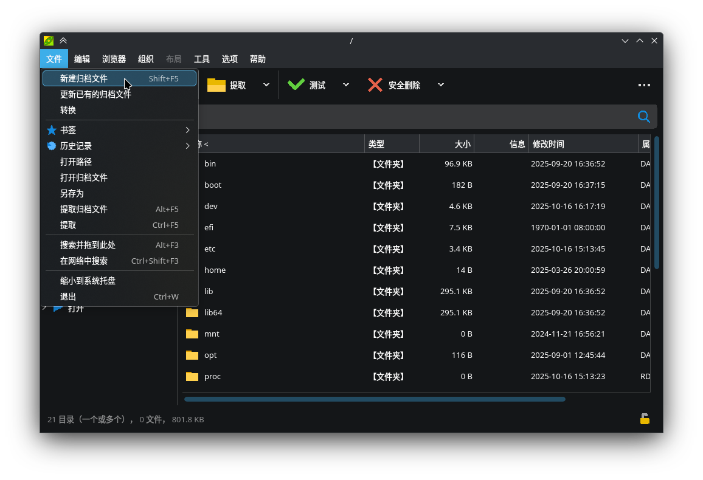
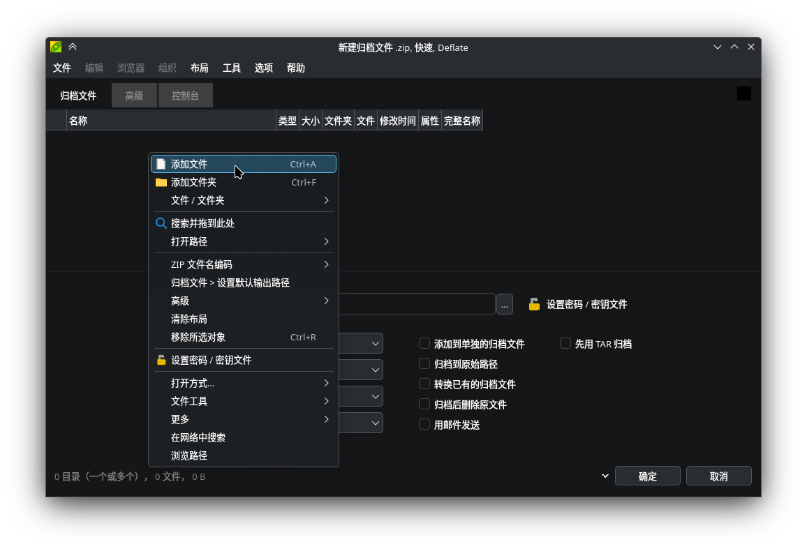
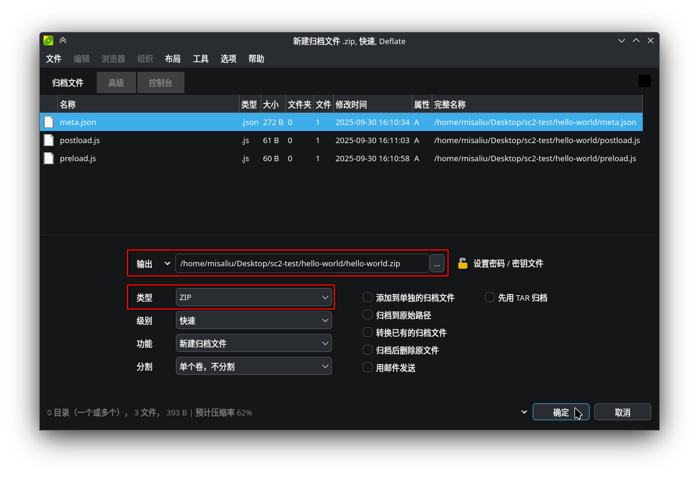

## 前期学习

SugarCube 是一款使用 HTML5 技术的游戏引擎，在制作模组前，我们强烈建议您 [学习 JavaScript](https://developer.mozilla.org/zh-CN/docs/Learn_web_development/Core/Scripting/What_is_JavaScript)。如果您有自定义样式的需求，您还可能会需要 [学习 CSS](https://developer.mozilla.org/zh-CN/docs/Learn_web_development/Getting_started/Your_first_website/Styling_the_content)。

SugarCube 内置了 jQuery v3。jQuery 是一个 JavaScript 库，它可以让您更方便地操作 HTML。您可以 [前往学习 jQuery](https://www.runoob.com/jquery/jquery-tutorial.html)。

## 环境准备

* 一款合适的压缩包处理工具。如果您不知道选择什么，[7-Zip](https://www.7-zip.org/) 或 [PeaZip](https://peazip.github.io/) 是不错的选择。
* 一款合适的文本编辑工具。如果您不知道选择什么， [VSCode](https://code.visualstudio.com/) 或 [Sublime Text](https://www.sublimetext.com/) 是不错的选择。

## 文件结构

一个 YASCML 模组压缩包的内部文件结构看起来大概是这样的：

```
hello-world/
├─ meta.json
├─ preload.js
├─ main/
│   └─ foo.js
└─ styles.css
```

请确保 `meta.json` 文件在模组压缩包根目录下，否则 YASCML 会找不到它。

## 编写 `meta.json`

YASCML 使用一个 JSON 文件（也就是 `meta.json`）来定义模组的元信息。`meta.json` 会被放置在模组压缩包的根目录下，以表明该压缩包是一个合法的 YASCML 模组。

一个最小的 `meta.json` 文件看起来像这样：

```jsonc
{
  // 模组的 ID，该字段是模组的唯一标识符，请不要随意修改
  "id": "hello-world",
  // 模组的名称，该字段一般用在模组管理器中
  "name": "Hello world",
  // 模组的作者，该字段拥有多个格式，可以前往 https://yascml.github.io/zh/reference/meta.json.html#author 查阅
  "author": "Misa Liu",
  // 模组的版本，该字段需要符合语义化版本规范，否则 YASCML 会拒绝加载
  "version": "1.0.0"
  // ...
  // 完整的 meta.json 文件参考可前往 https://yascml.github.io/zh/reference/meta.json.html 查阅
}
```

没错，一个最小的 `meta.json` 可以不附带任何脚本！但于此同时这个模组就没有任何功能了，只能让其他模组读取该模组压缩包内的数据。要实现任何功能，您必须为该模组编写脚本文件。

## 编写模组脚本

您可以自由地使用 JavaScript 编写模组脚本。我们建议您在编写脚本时遵循以下规范：

* 除非万不得已，请 **不要** 直接修改 `<tw-storydata>` 内的游戏数据。请使用现成的依赖模组（例如 YASCHook）修改游戏数据
* 建议使用 [立即调用函数表达式（IIFE）](https://developer.mozilla.org/zh-CN/docs/Glossary/IIFE) 来包裹脚本代码，以避免内部使用的变量污染到全局以导致不可预计的冲突：
    ```js
    (function() {
      'use strict';
      // ...your codes here
      console.log('Mod loaded!');
    })();
    ```
* 为了减小模组的体积和避免冲突，建议在实现某些功能前优先使用依赖模组而非自行实现

脚本默认仅支持同步初始化，如果您的脚本中需要等待异步操作（例如加载远程资源），请将它们添加到 `window.__AfterInit` 中：

```js
async function asyncInit() {
  // Async actions...
}

window.__AfterInit.push(
  asyncInit
);
```

## 打包模组文件

### 修改 `meta.json`

我们需要修改 `meta.json` 文件，以使 YASCML 可以正常地加载并运行刚才所编写的脚本文件。您需要在 `meta.json` 中添加 [`preloadScripts`](../reference/meta.json.md#preloadscripts) 和/或 [`postloadScripts`](../reference/meta.json.md#postloadscripts) 字段：

```jsonc
{
  // ...
  "preloadScripts": [
    "preload.js"
  ],
  "postloadScripts": [
    "main/foo.js"
  ],
  // ...
}
```

如果您不知道如何选择，您可以参考 [YASCML 的生命周期](../reference/life-cycle.md)。

### 制作模组压缩包

此处将以 [PeaZip](https://peazip.github.io/) 为例，演示如何创建一个模组压缩包。

1. 启动 PeaZip，从软件顶部的 `文件` 菜单中选择 `新建归档文件`：
    
2. 在文件列表中右键，在菜单中选择 `添加文件`：
    
3. 在弹出的文件选择器中，选择 `meta.json` 以及脚本文件：
    
4. 检查 PeaZip 的压缩参数：
    * 检查 `类型` 是否为 `ZIP`
    * 检查 `分割` 是否为 `不分割`
    * 检查压缩包密码是否为空（即输出目录旁边的黄锁是否上锁）
    * 记住压缩包的输出位置
    
5. 点击右下角的 `确定`，模组压缩包即成功被创建
